
<h1 align="center">基于jsp的问卷调查系统的设计与实现</h1>

## 简介
问卷调查系统：支持管理员和用户角色，提供用户管理、问卷管理、试题编辑、答题记录查看、注册登录等功能，界面设计简洁友好，操作便捷。    --计算机毕业设计源码；毕设源码；java毕业设计源码

## 联系方式

<h3 align="center">获取完整代码与数据库文件 + 微信：deepguan QQ: 86050149 QQ群: 783742310</h3>

<h3 align="center">可帮忙远程部署 包运行成功！提供远程部署、修改代码、设计文档指导、代码讲解等服务！</h3>

## 功能介绍（完整见运行截图）
管理员：  
基本功能包括登录和注册。用户管理模块支持查看、修改和删除用户信息，提供按用户名搜索功能。问卷管理模块允许创建、编辑和删除调查问卷，设定调查时长和问卷状态。试题管理模块提供试题编辑功能，支持单选、多选、填空题类型的创建与修改。系统记录功能则展示问卷答题记录，包括参与者的得分与答案。  

普通用户：  
基本功能包括登录和注册，并可通过信息填写完成新用户注册。个人中心模块提供个人信息修改与查看。用户可参与问卷答题，系统显示题目及倒计时信息，并提供答案提交功能。问卷答题过程简洁直接，支持查看问卷状态和相关提示。

## 运行截图
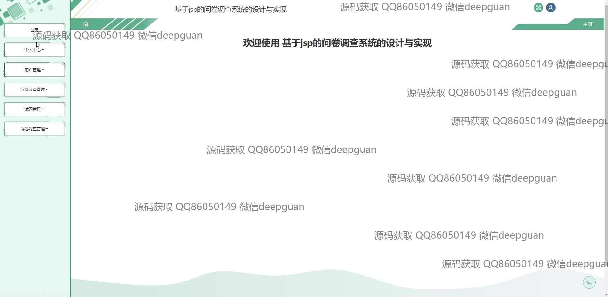
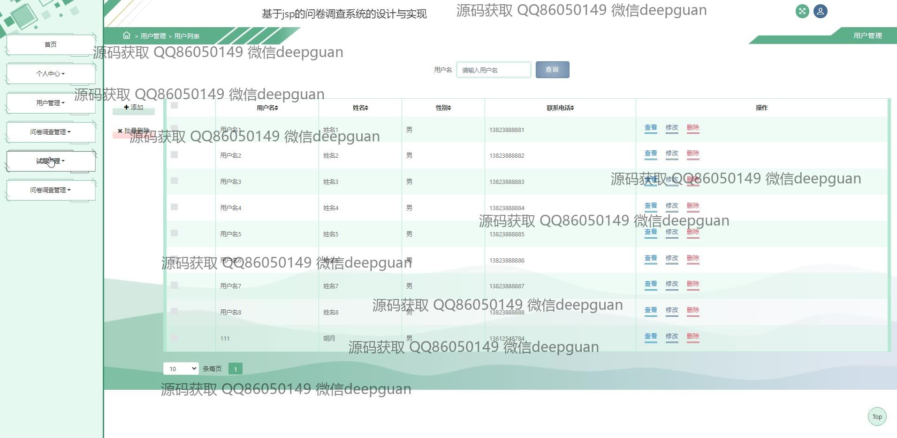
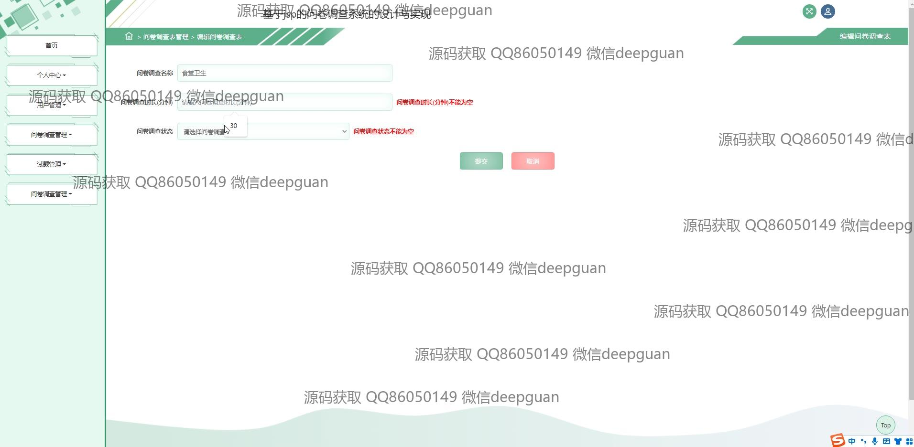
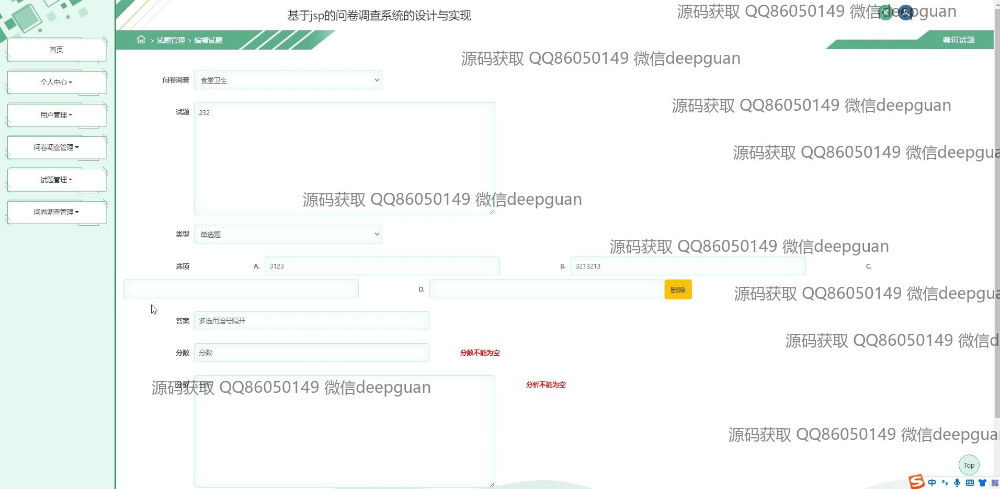
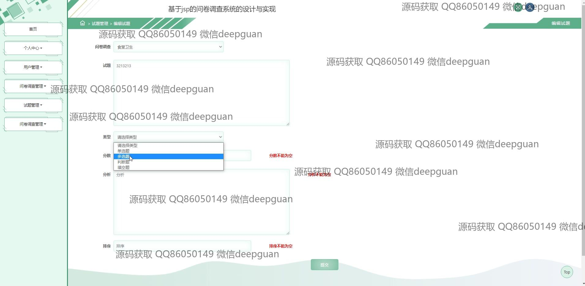
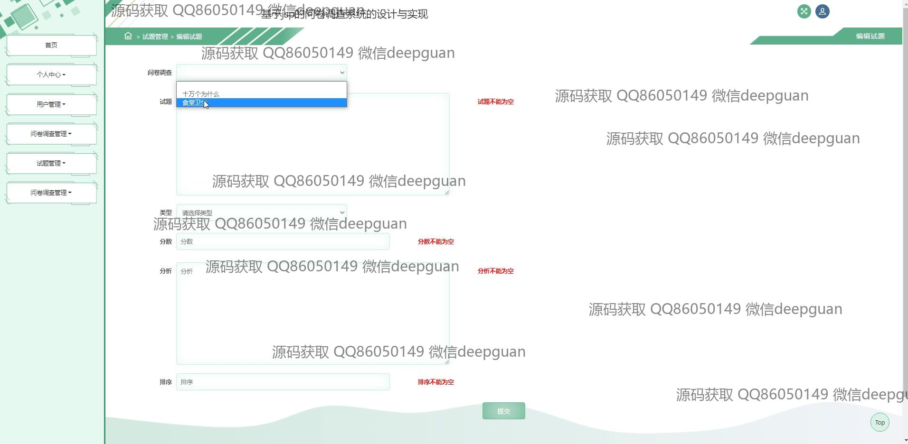
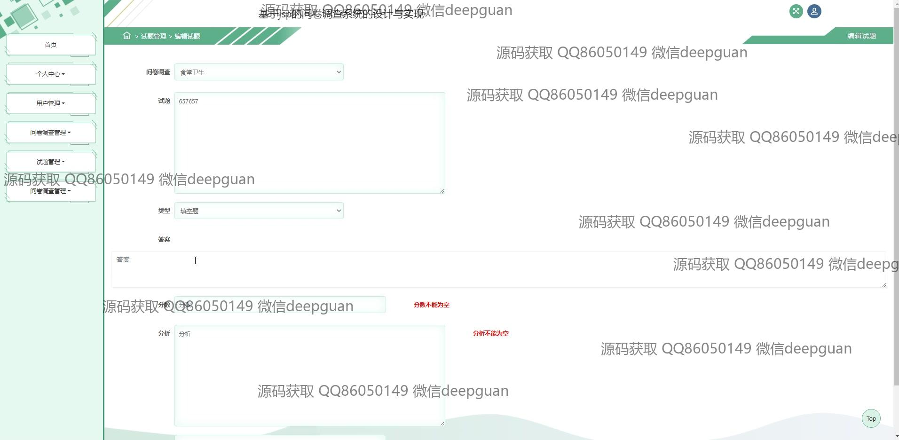
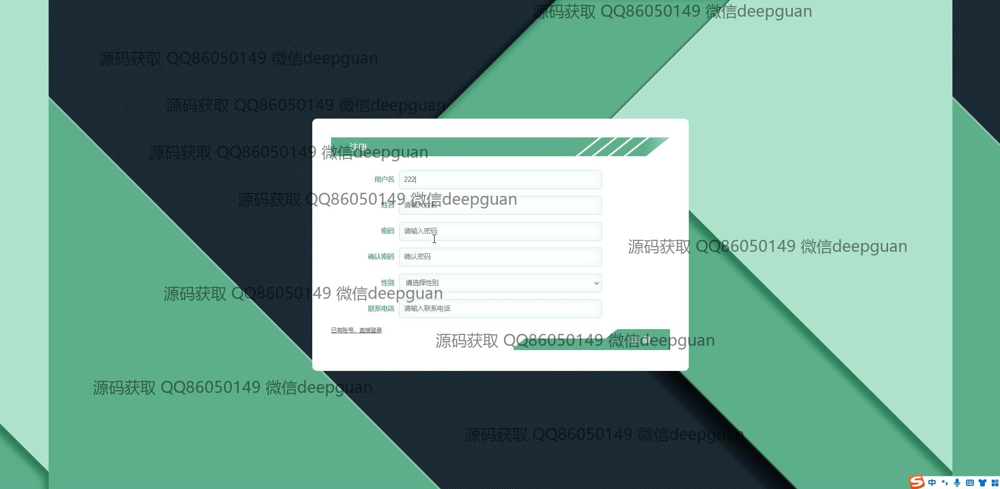
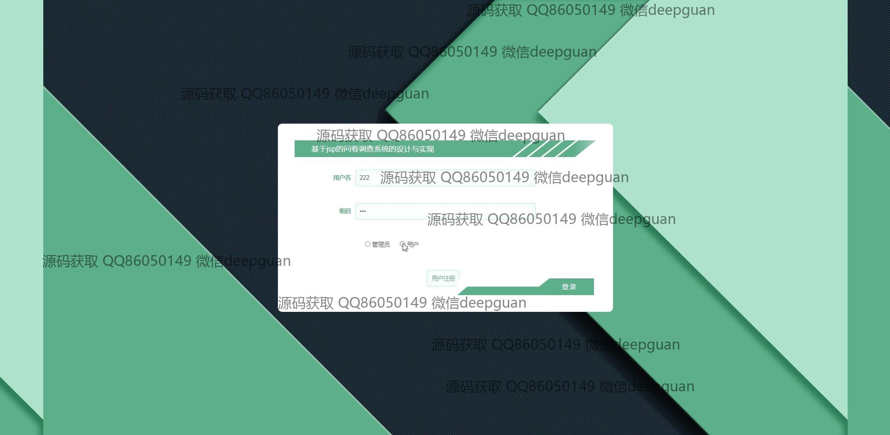
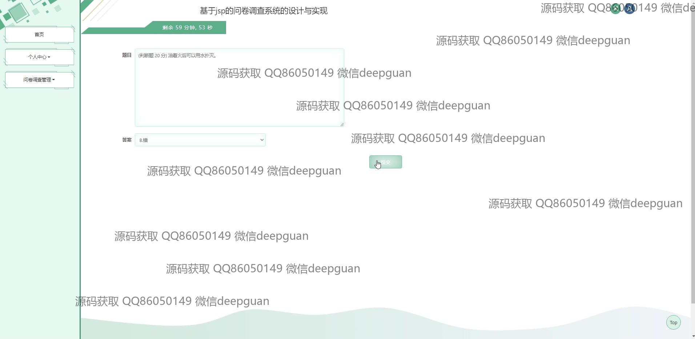
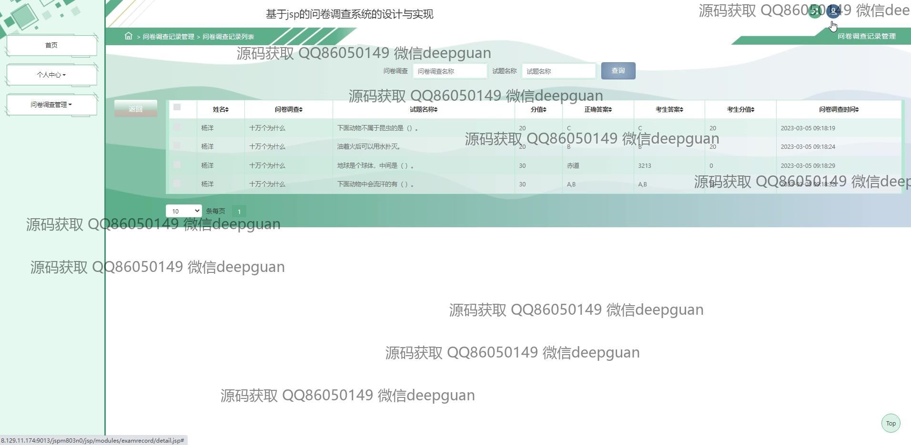

本代码来源于网络,仅供学习参考使用!

